- **Case Study**: 

Data Analysis for

DC Industries

Context and Objectives

- **DC Industries, a company specializing in consumer goods, aimed to analyze sales performance data to identify trends, optimize processes, and provide actionable insights. The objectives were**: 

To identify the most profitable regions, categories, and subcategories.

To analyze profit distribution by day of the week.

To clean and prepare the dataset for further reporting.

Data Processing Steps

1. Loading the Data

- **Objective**: Import and validate datasets from various sources for analysis.

- **Method**: 

Imported two Excel files containing orders from the East (295 records) and West (230 records) regions.

Imported a CSV file mapping U.S. states to their respective regions.

Verified dataset headers and row structures using the Input Data Tool in Alteryx.

- **Result**: Successfully loaded all datasets, totaling 525 records from the order files and a reference table for regions.

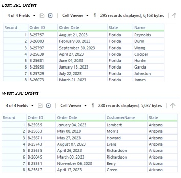

2. Merging Datasets and Removing Duplicates

- **Objective**: Create a unified dataset and ensure data integrity by eliminating duplicates.

- **Method**: 

Used the Union Tool to combine the East and West order datasets.

Applied the Unique Tool to check for duplicates using the Order ID field as the unique identifier.

Identified and removed 25 duplicate records.

- **Result**: A unified dataset with 500 unique orders, ensuring reliable downstream analysis.

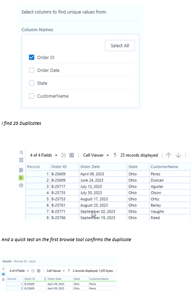

3. Adding Regional Information

- **Objective**: Enrich the dataset by associating orders with their respective regions.

- **Method**: 

Joined the orders dataset with the region mapping table using the State field via the Join Tool.

Added a simplified RegionCode field (e.g., NE, SE, WE) using a Text Input Tool.

Duplicated fields from the join were deselected for clarity.

- **Result**: The dataset now includes regional information, with concise codes for grouping and analysis.

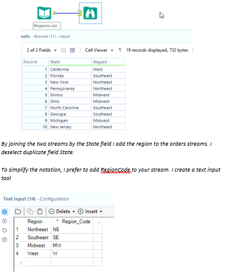

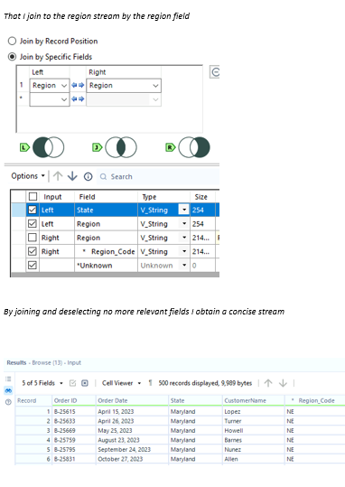

4. Cleaning and Transforming Data

- **Objective**: Ensure that fields are formatted correctly and ready for analysis.

- **Method**: 

Reformatted the Order Date field using a parsing tool to convert it into a proper date format.

Extracted the Day of the Week (DoW) from the Order Date field, creating a new temporal dimension for analysis.

- **Result**: The dataset now includes properly formatted date fields and an additional Day of the Week column for temporal analysis.

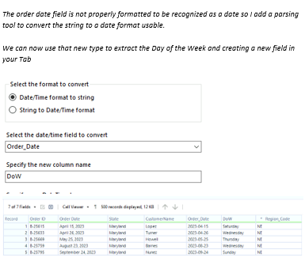

Analysis and Insights

1. Most Profitable Day of the Week

- **Objective**: Identify which day of the week generates the most profit.

- **Method**: 

Grouped data by Day of the Week using the Summarize Tool.

Calculated total profits for each day.

Created a visualization to highlight the most profitable day.

- **Result**: 

Friday is the most profitable day, generating $295,745.96 in total profit.

SE has the highest order count every day except Thursday.

No one day shows particularly high or low activity.

No one region seems to be significantly over/under performing the others.

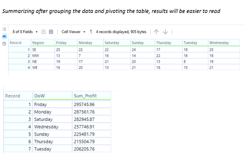

2. Profitability by Category and Region

- **Objective**: Analyze profitability patterns by product category and region.

- **Method**: 

Grouped data by Category and Region.

Calculated total profits and percentages for each combination.

Highlighted high- and low-performing regions for each category.

- **Result**: 

West region leads in overall profitability.

South-East region excels in the Clothing category.

North-East region consistently underperforms in all categories.

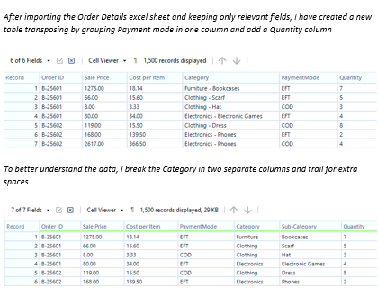

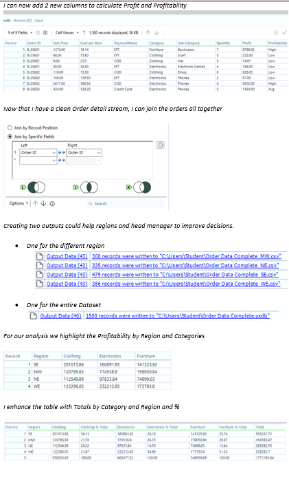

- **Insights**: 

- **Clothing**: South-East leads in profitability, suggesting a regional preference or effective strategy in this category.

- **Electronics and Furniture**: West dominates, potentially due to higher demand or pricing strategies.

North-East may require targeted marketing or operational improvements to boost performance.

3. Top 25 Most Profitable Orders

- **Objective**: Highlight the most profitable individual orders.

- **Method**: 

Ranked orders by total profit using the Sort Tool.

Extracted the top 25 orders for detailed analysis.

- **Result**: 

The top 25 orders contributed over $1,200,000 in total profit.

The single most profitable order generated $93,292.01.

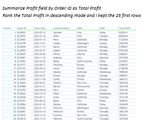

4. Most Profitable Subcategories

- **Objective**: Determine the top subcategories contributing to profit within each category.

- **Method**: 

Grouped data by Category and Sub-Category.

Summarized total profits for each subcategory.

Ranked subcategories by profitability within each category and selected the top three.

- **Result**: 

Printers emerged as the top subcategory, followed by Monitors and Office Supplies.

Insights reveal opportunities to prioritize inventory and marketing for these high-performing subcategories.

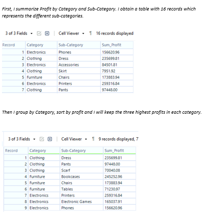

Final Workflow Overview

- **Description**: The entire data preparation and analysis workflow in Alteryx was documented and optimized for reusability:

The workflow included steps for data loading, cleaning, transformation, and analysis.

- **Outputs were generated in two formats**: 

Regional-specific summaries.

A consolidated dataset for company-wide reporting.

Key Insights and Recommendations

- **Day-Specific Focus**: Friday's high profitability may be due to successful promotions or increased consumer activity. Replicating these strategies across other days could boost overall performance.

- **Regional Strategy**: 

Enhance marketing and operations in the North-East to address underperformance.

Leverage the South-East's success in the clothing category by expanding inventory or running targeted promotions.

- **Subcategory Optimization**: Prioritize high-profit subcategories like Printers and Monitors for marketing and inventory. Consider cross-selling to improve underperforming subcategories.

- **Automation Opportunities**: Automate the workflow for consistent, real-time reporting, reducing manual effort and increasing efficiency.

Next Steps

Develop a Power BI dashboard for real-time tracking of profits by region, category, and day.

Investigate customer behaviors in the South-East and Friday sales to understand success factors.

Implement strategies to improve performance in the North-East and low-profit subcategories.

Alteryx Workflow

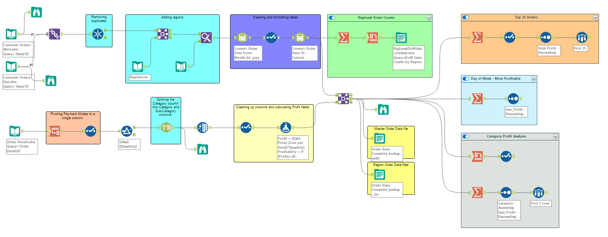
