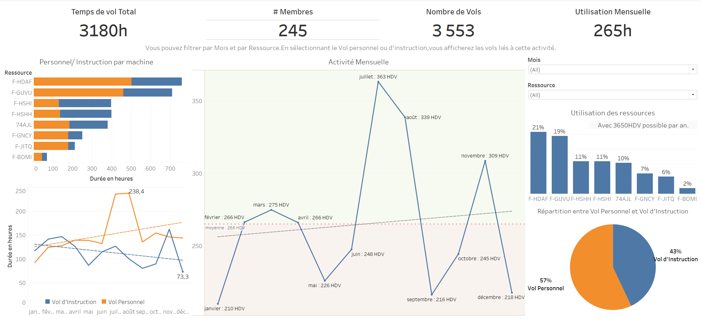
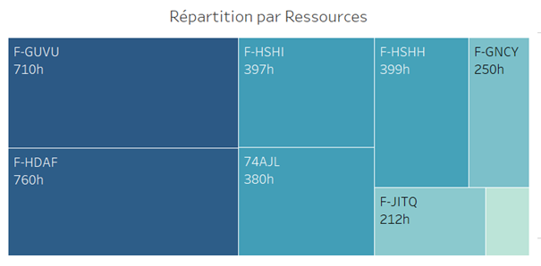
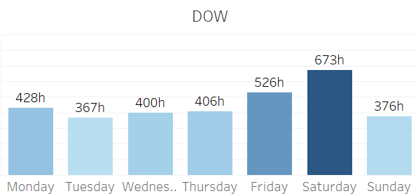
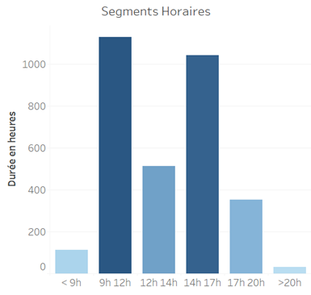
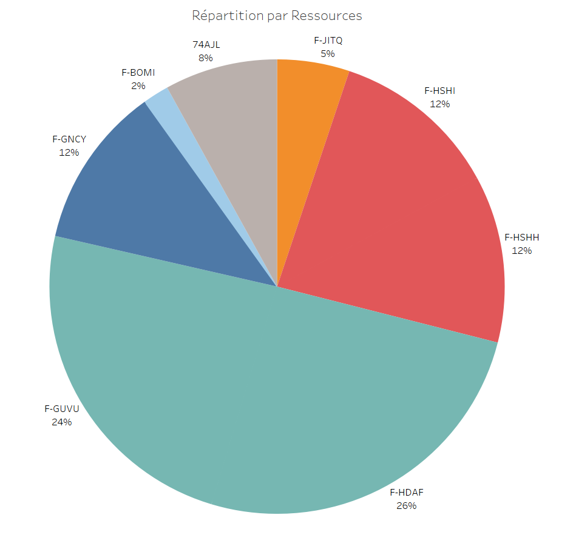
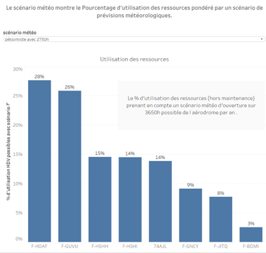
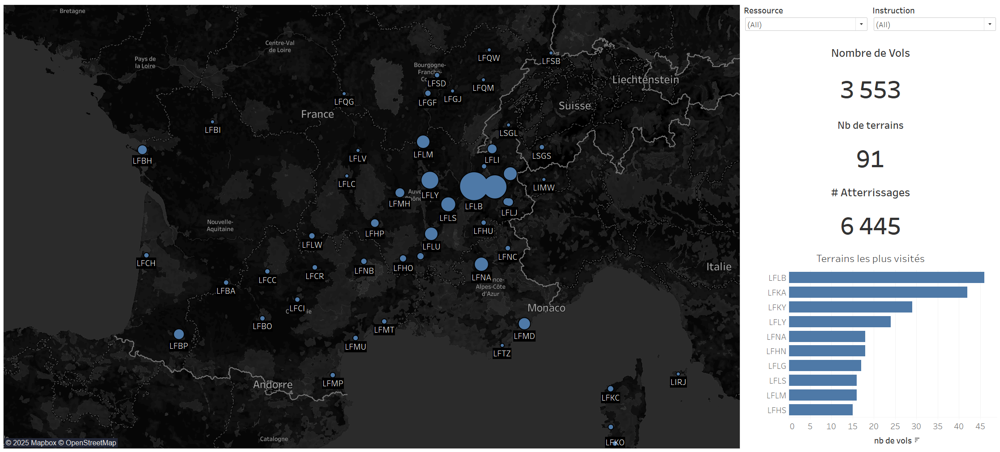

# AeroClub Operational Analysis (2024)

## Disclaimer

The data used in this analysis belongs exclusively to the Annecy AeroClub and has been anonymized to ensure privacy and confidentiality. The purpose of this report is to showcase the operational performance of the AeroClub, demonstrate advanced data analysis skills, and provide actionable recommendations for improving operations, member engagement, and financial outcomes.

---

## Overview

This analysis provides a comprehensive evaluation of the Annecy AeroClub’s performance in 2024. It explores fleet utilization, financial outcomes, and member activity while leveraging data visualization tools like Tableau to uncover trends and propose data-driven solutions. The report balances technical depth with actionable insights, tailored for stakeholders such as data analysts, pilots, and AeroClub leadership.

---

## Key Questions Addressed
1. **How efficiently is the fleet being utilized, and which aircraft require attention?**
2. **What temporal patterns can be leveraged to boost activity during low-demand periods?**
3. **How can financial performance be improved while maintaining high service quality?**
4. **What are the key drivers of member engagement, and how can they be enhanced?**

---
## Dashboard Interactive



Explore the interactive **Tableau dashboard** for a deeper dive into the customer churn analysis.

---
## Fleet Utilization Analysis


### Insights
- **Fleet Distribution**:
- **Fleet Composition and Utilization :**

- ***8 aircraft divided into 4 categories:***

-2 PS-28 (HSHH/HSHI): Primarily dedicated to training (66%).
-2 DA-40 (GUVU/HDAF): Versatile aircraft with high utilization.
-1 DA-40 NG (GNCY): Designed for travel purposes.
-1 A22 (74AJL): Ultralight aircraft (ULM) used for training.
-1 XL8 (JITQ), 1 PA-19 (BOMI): For specific purposes.



  - 75% of total flight hours are handled by DA-40 (HDAF, GUVU) and PS-28 aircraft.
  - Underutilized aircraft: XL8 (212 HDV) and BOMI (69 HDV).
- **Aircraft Roles**:
  - DA-40 NG (GNCY): Primarily used for advanced training, including CPL preparation, contributing 40% of its flight hours to professional qualifications.
  - PS-28: Critical for instruction, with 67% of hours dedicated to this activity.

### Recommendations
1. **Increase Utilization**:
   - Launch targeted campaigns promoting BOMI and XL8, emphasizing their unique capabilities.
2. **Dynamic Pricing**:
   - Introduce tiered pricing based on aircraft demand and time slots.
3. **Strategic Positioning**:
   - DA-40 NG should cater to pilots aiming for advanced certifications like IFR.

---

## Member Engagement and Activity

### Insights
- **Active Membership**:
  - 245 members flew in 2024, averaging 13 HDV per member.
  - 15 members contributed 22% of total flight hours, indicating a high level of activity among a core group composed most of students. 
- **Instructional Impact**:
  - One instructor accounted for 16% of all instructional activity (220 HDV).

### Recommendations
1. **Loyalty Programs**:
   - Reward highly engaged members with discounted training hours.
2. **Event-Driven Engagement**:
   - Host off-season events or competitions to boost activity during low-demand months.
3. **Instructor Retention**:
   - Develop incentives for top-performing instructors to maintain high instructional standards.

---

## Temporal Trends and Seasonality

### Insights
- **Seasonal Peaks**:
  - Highest activity: July (363 HDV), August (339 HDV).
  - Lowest activity: December (73 HDV), primarily due to adverse weather conditions.
- **Daily Patterns**:
- 
  
  
  - Saturdays dominate, with minimal activity on Tuesdays.
  - Underused time slots: 12 PM–2 PM.
  - 
  

### Recommendations
1. **Optimize Low-Demand Hours**:
   - Offer discounted flights or free discovery sessions during underutilized season.
2. **Promote targetted instruction**:
   - Promote instruction during the underused time slots to improve fleet usage.
3. **Data-Driven Scheduling**:
   - Focus on aligning instructional hours with low-demand periods for maximum impact.
4. **Limit the length**:
   - By Limiting the length of a reservation during the high-demand days (Saturday) will increase the number of activity.
---

## Financial Performance

### Insights
- **Revenue**:
  - DA-40 NG generates the highest revenue per flight (€221), while A22 AJL is the least profitable (€93).
- **Revenue Split**:
  -Half of the revenue are produced by the DA-40 HDAF and GUVU
  
    
  
  - Personal flights: 53% of total revenue.
  - Instruction: 47%, primarily supported by PS-28 aircraft.

### Recommendations
1. **Focus on Profitability**:
   - Reassess the viability of low-performing aircraft like BOMI and XL8.
2. **Boost Instruction Revenue**:
   - Introduce accelerated training programs during off-peak seasons.
3. **Operational Cost Analysis**:
   - Conduct a detailed study of aircrafts costs.

---

## Data-Driven Projections and Scenarios

### Weather Analysis Summary
- **Data Source**: Historical weather data, focusing on rainfall and visibility.
- **Key Metrics**:
  - Average 8 rainy days/month in Haute-Savoie.
  - Operational efficiency estimated between **75% (pessimistic)** and **81% (optimistic)** based on precipitation impact.
- **Impact**:
  - Reduction in operational hours during adverse conditions, influencing fleet availability and revenue.

### Scenarios
*based on the data-driven weather analysis summary*

1. **Optimistic**:
   - Projected 2,950 HDV, assuming favorable weather.
2. **Pessimistic**:
   - Projected 2,750 HDV, accounting for adverse conditions.


---

## Challenges and Solutions

### Challenges Encountered
1. **Data Source Consistency**:
   - Issues integrating new months due to mismatched column names in CSV files.
   - Manual adjustments required for schema alignment.
2. **Limited Automation**:
   - Updates were manual, increasing risk of errors.

### Proposed Solutions
1. **Centralized Data Repository**:
   - Maintain a structured folder hierarchy for raw and processed data.
     ```
     /Data/
     ├── Raw/
     │   ├── flight_logs.csv
     │   
     └── Processed/
         ├── cleaned_data.csv
         ├── consolidated_data.csv
     ```
2. **Intermediate Data Model**:
   - Use tools like Python or Alteryx for consistent preprocessing and schema enforcement.
3. **Automation**:
   - Automate data updates with scripts or live connections in Tableau.

---

## To Go Further

1. **Expand Financial Analysis**:
   - Incorporate detailed cost metrics to evaluate profit margins.
2. **Maintenance Impact**:
   - Assess how scheduled and unscheduled maintenance affects fleet availability and revenue.
3. **Historical Trends**:
   - Conduct multi-year comparisons to identify long-term trends and areas for improvement.
4. **Enhanced Data Visualization**:
   - Add geospatial uncovered data to increase flight patterns and destination analysis.

    
     
5. **Predictive Analytics**:
   - Build machine learning models to forecast member activity and operational demand.
6. **Members Data**
   - By grouping Members we can go in deep analysis to find members patterns to enhance services.
---

## Conclusion

This report highlights the key operational trends and offers a roadmap for strategic improvements at the Annecy AeroClub. The insights are tailored to optimize fleet usage, enhance member engagement, and drive financial performance. By addressing current challenges and leveraging advanced data analytics, the AeroClub can achieve sustained growth and maintaining members satisfaction.


## Technical Analysis

### Overview
This document provides a detailed breakdown of the technical steps taken to conduct the AeroClub Operational Analysis, including data preparation, visualizations, and key calculations.

### Analysis Steps

#### Data Preparation
- **Objective:** Prepare data for analysis by consolidating multiple sources, including flight logs and financial reports.
- **Tools:** Power Query for data cleaning.
- **Steps:**
  - Standardized column names and formats.
  - Removed duplicates and handled missing values.

#### Fleet Utilization Analysis
- **Objective:** Evaluate usage rates of different aircraft.
- **Visualization:** Bar charts and pie charts highlighting flight hours per aircraft.
- **KPI:** Utilization rate = Hours flown / Total available hours.

#### Seasonality Trends
- **Objective:** Identify patterns in flight activity.
- **KPI Calculation:**
  ```markdown
  Saison = IF DATEPART('month', [Date]) IN (3, 4, 5) THEN 'Printemps'
           ELSEIF DATEPART('month', [Date]) IN (6, 7, 8) THEN 'Été'
           ELSEIF DATEPART('month', [Date]) IN (9, 10, 11) THEN 'Automne'
           ELSE 'Hiver'
  ```
- **Visualization:** Line charts showing monthly trends.

#### Financial Performance
- **Objective:** Assess revenue distribution by aircraft and activity type.
- **KPI Calculation:** Revenue per hour = Total revenue / Flight hours.
- **Visualization:** Scatter plots and heatmaps.

### Technical Implementation
#### Calculations in Tableau
1. **Hourly Bins:**
   ```markdown
   Horaire_bin = CASE
                 WHEN DATEPART('hour', [Heure]) < 9 THEN 'Matin'
                 WHEN DATEPART('hour', [Heure]) < 14 THEN 'Midi'
                 ELSE 'Après-midi'
                 END
   ```
2. **Projection Scenarios:**
   - Optimistic:
     ```markdown
     Projected_hours = Current_hours + Growth_rate * Remaining_period
     ```
   - Pessimistic:
     ```markdown
     Projected_hours = Current_hours - Decline_rate * Remaining_period
     ```

#### Dashboard Implementation
- **Tools Used:** Tableau for visualizations.
- **Steps:**
  1. Imported cleaned datasets.
  2. Created calculated fields for KPIs.
  3. Designed dashboards with filters for interactivity.

### Findings
#### Key Visualizations
1. **Fleet Utilization:**
   
2. **Seasonality Trends:**
   
3. **Financial Performance:**
   

#### Recommendations
- Encourage use of underutilized aircraft (e.g., XL8, BOMI).
- Optimize schedules to increase off-peak activity.
- Develop tailored promotions to improve member engagement.

### Dashboard Evidence
- Full dashboards are available upon request, with certain sections redacted to maintain confidentiality.

### Disclaimer
All data are property of the Annecy AeroClub and are shared under strict confidentiality agreements. Unauthorized distribution is prohibited.
