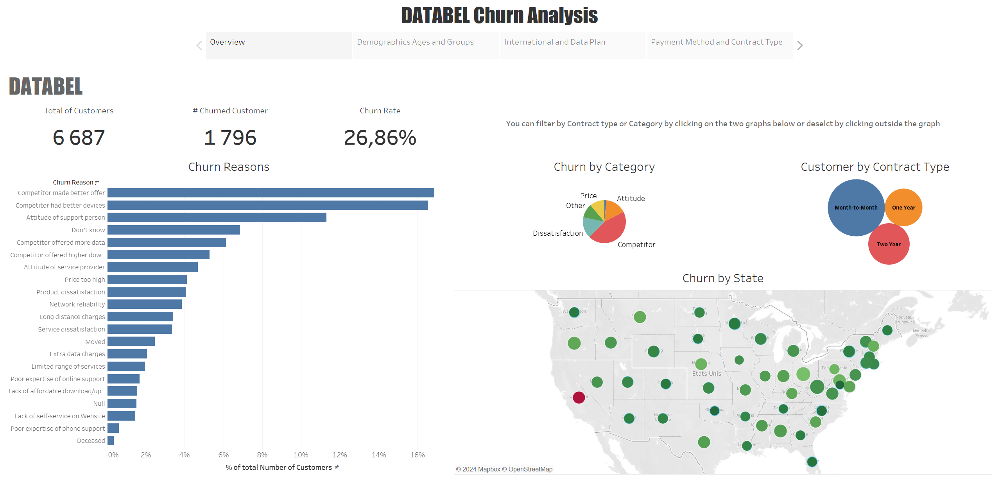

# Customer Churn Analysis – Tableau

**Case study realised on Tableau Public during my Tableau track on DataCamp, leveraging Tableau to analyze customer churn trends. Covers data exploration, dashboard creation, and actionable insights. Includes churn factors related to contract types, geography, and demographics.**

## Description
This project demonstrates how to analyze customer churn using interactive dashboards created with Tableau. It focuses on understanding the factors contributing to churn, such as contract types, demographics, and geographic regions, and provides recommendations for reducing churn.

**Note:** The dataset used for this analysis cannot be shared publicly due to confidentiality reasons.

## Project Structure
- **readme.md**: This file (Markdown format).
- **Tableau_databel-customer-churn-analysis.md**: Detailed case study document (Markdown format).

## Dashboard Interactive

Explore the interactive **Tableau dashboard** for a deeper dive into the customer churn analysis.  
[View the dashboard on Tableau Public](https://public.tableau.com/app/profile/jc.coissard/viz/databel_case_study/DATABELChurnAnalysis)

## Key Insights & Recommendations
- **Monthly Contracts**: Have a churn rate of 40%, indicating a need for intervention.  
- **Bundled Contracts**: Reduce churn significantly to 6.51%.  
- **California Region**: Has a churn rate of 63%, suggesting a focused strategy for retention.  
- **Demographic Impact**: Younger customers (18-25) show the highest churn rates.

## Next Steps
- Focus on improving retention in California and for monthly contract holders.  
- Expand promotional offers for bundled contracts to reduce churn further.  
- Conduct deeper analysis on customer demographics to create targeted retention strategies.

## Disclaimer
The data used in this analysis is sourced from DataCamp and is used solely for educational purposes. The analysis, insights, and visualizations provided in this repository are created by the author and are not affiliated with or endorsed by DataCamp. All content in this repository, including the methodology and results, is for personal, academic, and professional development purposes only. The intellectual property rights of the original dataset and any associated content belong to DataCamp.
